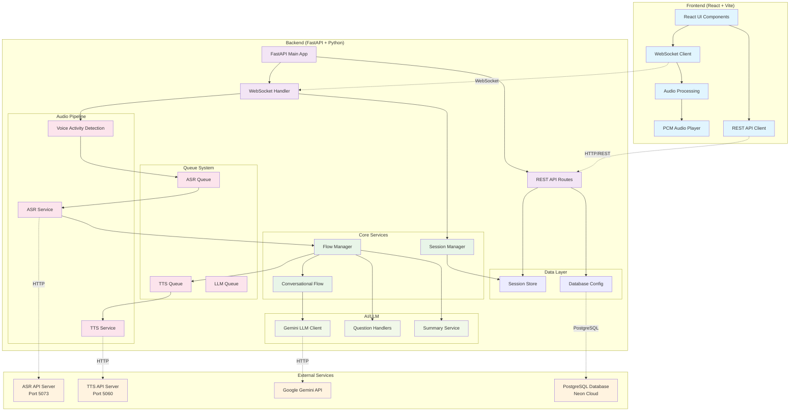
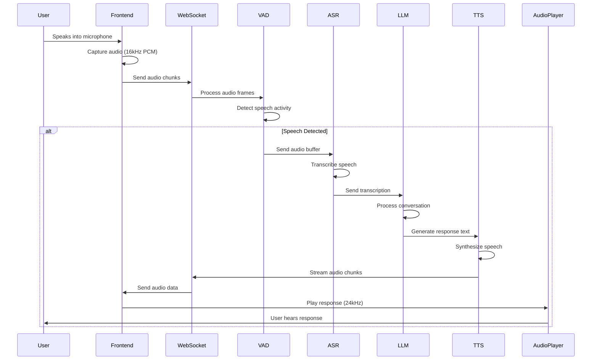
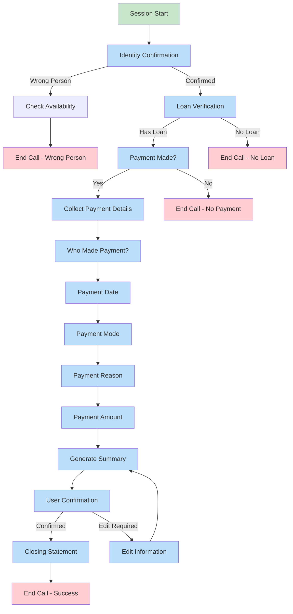
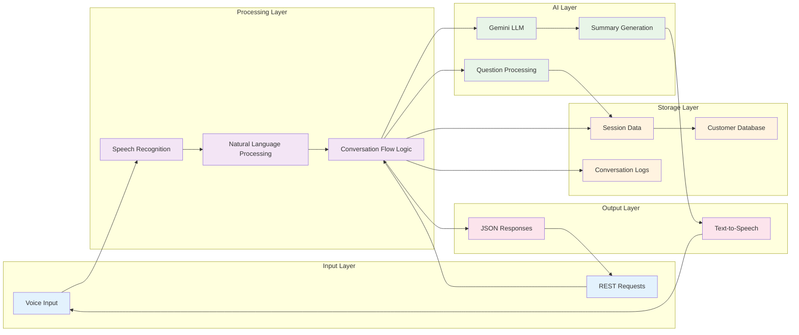
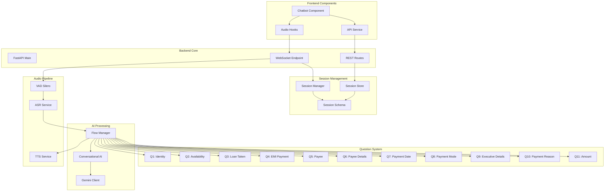
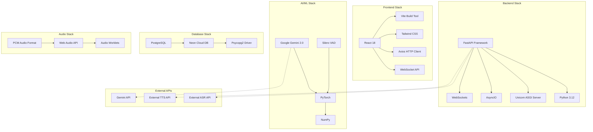
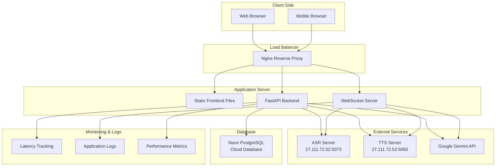
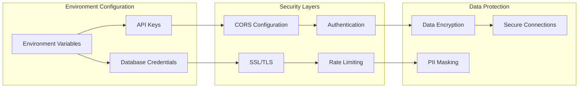

# LTFS Conversational Flow - Architecture & Flow Diagrams

## 1. System Architecture Overview

## 2. Audio Processing Flow

## 3. Conversational Flow Architecture

## 4. Data Flow Architecture

## 5. Component Interaction Diagram

## 6. Technology Stack

## 7. Deployment Architecture

## 8. Security & Configuration

## Key Features & Capabilities

### Real-time Audio Processing
- **16kHz PCM input** for speech recognition
- **24kHz PCM output** for text-to-speech
- **Voice Activity Detection** using Silero VAD
- **Streaming audio** with WebSocket communication

### Intelligent Conversation Flow
- **Dynamic question routing** based on responses
- **Context-aware processing** with session management
- **Multi-language support** (Hindi/English/Hinglish)
- **Fallback mechanisms** for unclear responses

### Scalable Architecture
- **Microservices design** with queue-based processing
- **Async/await patterns** for high concurrency
- **External API integration** for ASR/TTS services
- **Cloud database** with connection pooling

### Monitoring & Analytics
- **Latency tracking** for performance optimization
- **Conversation logging** for quality assurance
- **Error handling** with graceful degradation
- **Real-time metrics** collection