# LTFS Conversational Flow - Detailed Flow Diagrams

## 1. Complete User Journey Flow

## 2. Audio Processing Pipeline Flow

```mermaid
sequenceDiagram
    participant User as 👤 User
    participant Frontend as 🖥️ Frontend
    participant WebSocket as 🔌 WebSocket
    participant VAD as 🎙️ VAD Service
    participant ASR as 🗣️ ASR Service
    participant FlowMgr as 🧠 Flow Manager
    participant LLM as 🤖 Gemini LLM
    participant TTS as 🔊 TTS Service
    participant AudioPlayer as 🎵 Audio Player

    Note over User,AudioPlayer: Audio Processing Pipeline

    User->>Frontend: Speaks into microphone
    Frontend->>Frontend: Capture audio at 16kHz PCM
    Frontend->>WebSocket: Send audio chunks (320 samples)
    
    WebSocket->>VAD: Process audio frame
    VAD->>VAD: Analyze speech probability
    
    alt Speech Detected (probability > threshold)
        VAD->>VAD: Buffer audio data
        Note over VAD: Continue buffering until silence
        VAD->>ASR: Send complete utterance
        ASR->>ASR: Transcribe audio to text
        ASR->>FlowMgr: Send transcription
        
        FlowMgr->>FlowMgr: Determine conversation stage
        FlowMgr->>LLM: Process with context
        LLM->>LLM: Generate response & extract data
        LLM->>FlowMgr: Return structured response
        
        FlowMgr->>FlowMgr: Update session data
        FlowMgr->>TTS: Send response text
        TTS->>TTS: Synthesize speech at 24kHz
        TTS->>WebSocket: Stream audio chunks
        WebSocket->>Frontend: Forward audio data
        Frontend->>AudioPlayer: Play response audio
        AudioPlayer->>User: User hears response
    else No Speech Detected
        VAD->>WebSocket: Continue monitoring
    end
    
    Note over User,AudioPlayer: Cycle continues until conversation ends
```

## 3. Session Management Flow

## 4. Question Flow Logic

## 5. Data Extraction and Processing Flow

## 6. Error Handling and Fallback Flow

## 7. Performance Monitoring Flow

## Key Performance Indicators (KPIs)

### Latency Metrics
- **VAD Processing**: < 50ms per frame
- **ASR Processing**: < 2 seconds per utterance
- **LLM Processing**: < 3 seconds per request
- **TTS Processing**: < 1 second for first chunk
- **End-to-End**: < 5 seconds total response time

### Quality Metrics
- **ASR Accuracy**: > 95% for clear speech
- **Intent Recognition**: > 90% accuracy
- **Conversation Completion**: > 85% success rate
- **User Satisfaction**: Based on successful data collection

### System Metrics
- **WebSocket Connection**: 99.9% uptime
- **Database Response**: < 100ms average
- **Error Rate**: < 1% of total interactions
- **Concurrent Users**: Support for 100+ simultaneous sessions