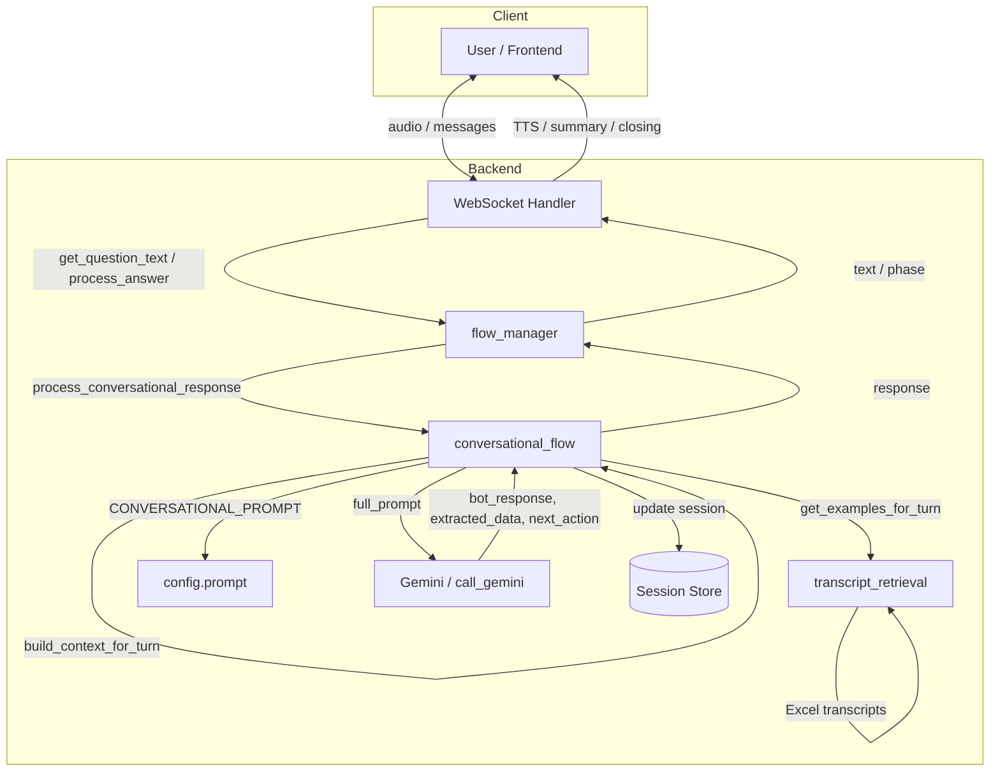
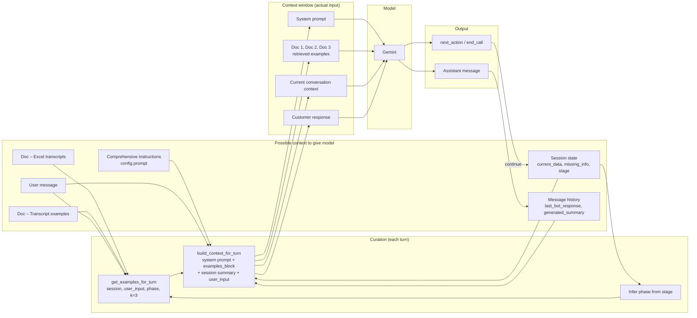
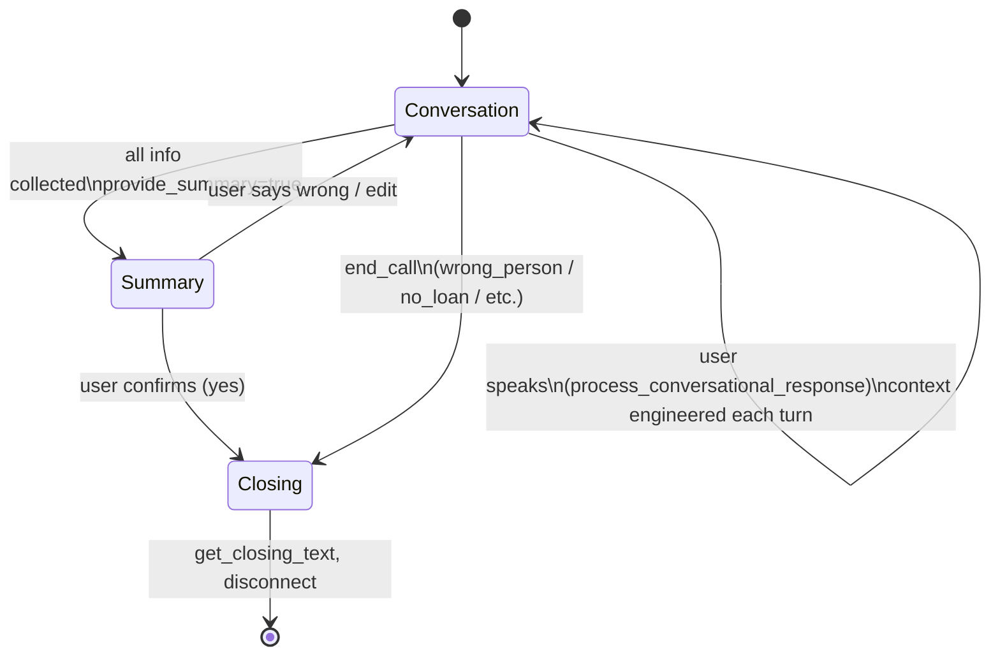
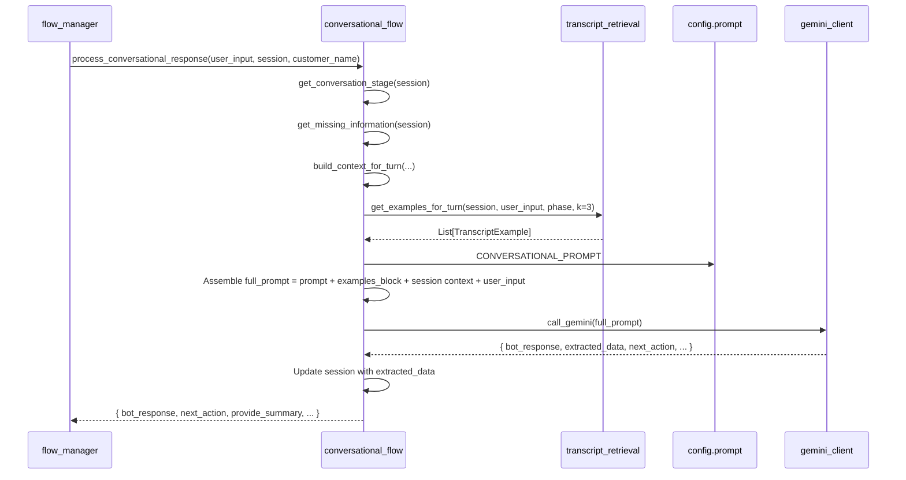
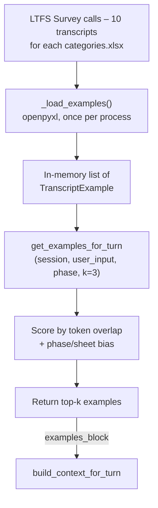

# LTFS Conversational Call Flow – Diagrams

## 1. End-to-end call flow (high level)

---

## 2. Context engineering (per turn)

*Each time the user speaks, the system curates what goes into the model’s context window.*

---

## 3. Conversation phase flow (session state)

---

## 4. Single-turn pipeline (context → response)

*What runs inside `process_conversational_response` for one user message.*

---

## 5. Transcript retrieval (context source)

---

## 6. Context-catching tools (optional)

When `USE_CONTEXT_TOOLS=true` in env, the model can **call tools** to fetch context before responding:

- **get_transcript_examples(phase, query, max_results)** – returns relevant call snippets from the Excel transcripts.
- **get_session_summary()** – returns current session state (identity, loan, payment fields, stage).

Flow: prompt + tools → model → (optional) tool_call → execute_tool → append result to contents → model again → … → final JSON. Implemented in `llm/context_tools.py` and `llm/gemini_client.call_gemini_with_tools`.

---

## How to view

- **VS Code**: Install “Mermaid” or “Markdown Preview Mermaid Support” and open this file in preview.
- **GitHub**: Push this file and view the repo; GitHub renders Mermaid in `.md` files.
- **Online**: Copy a code block into [mermaid.live](https://mermaid.live) to edit or export as PNG/SVG.
